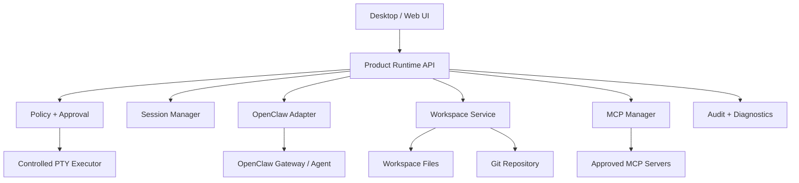

# OpenClaw Workbench 架构冻结稿 v0.1

## 1. 分层



## 2. 组件职责

### UI
只负责展示状态、提交用户意图、展示 Diff/命令/风险和收集批准。不得持有模型 Secret，不得直接执行文件或终端操作。

### Product Runtime API
产品稳定接口层。所有请求先做输入 schema 校验、会话绑定、权限判断和审计，再进入底层 Adapter 或服务。

### OpenClaw Adapter
封装 OpenClaw 版本差异，支持 Gateway WS 和受控 local fallback。禁止把内部模块路径暴露给 UI。

### Workspace Service
负责工作区根目录、路径穿越防护、忽略规则、文件大小限制、敏感文件识别、Git 状态和快照。

### Policy + Approval
根据模式、用户、工作区、工具、命令和目标资源计算权限。批准必须绑定 action hash、session、device、expiry 和 workspace revision。

### Controlled PTY Executor
独立进程组执行命令，具备超时、取消、输出上限、环境变量过滤、工作目录限制和进程树回收。

### MCP Manager
管理已批准的 MCP Server 定义、健康状态、能力清单、工具权限、凭据引用和生命周期。默认拒绝未知 Server。

### Audit + Diagnostics
结构化记录关键动作、策略决定、审批、结果和错误分类；导出前脱敏并让用户预览范围。

## 3. 核心数据对象

```text
Workspace { id, root, revision, allowedPaths, sensitivePatterns }
Session { id, workspaceId, mode, actor, deviceId, status }
Action { id, type, sessionId, target, preview, actionHash, risk, status, expiresAt }
Approval { actionId, actor, scope, decision, nonce, expiresAt }
ModelProfile { id, provider, protocol, capabilities, secretRef, health }
McpServer { id, transport, command/url, capabilities, policy, health }
AuditEvent { id, timestamp, actor, sessionId, actionId, type, redactedPayload }
```

## 4. 首个垂直切片

只做一条端到端闭环，不先做全量 UI：

```text
创建隔离测试工作区
→ 读取文件
→ Plan 生成方案
→ 生成 Patch 预览
→ 用户批准
→ 原子应用 Patch
→ 运行测试命令
→ 记录审计
→ 回滚 Patch
```

垂直切片必须先在 CLI/测试 harness 中通过，再接桌面 UI。这样 UI 不会掩盖 Runtime 缺陷。

## 5. 技术选型暂定

- Runtime：TypeScript，Node `>=22.19.0`，与当前 OpenClaw 运行时一致。
- 桌面壳：首选 Tauri；若 OpenClaw Node 集成验证显示 IPC/打包成本过高，再评估 Electron。
- UI：先做 Web-compatible 前端，避免把业务逻辑写入桌面壳。
- 协议：内部 API 使用 versioned JSON schema；事件采用有序、可重放的 event envelope。
- 存储：先使用本地 SQLite/JSON 分层；Secret 只进入系统密钥环或 OpenClaw SecretRef，不进入普通业务数据库。

技术选型在完成隔离 PoC、性能和打包验证前不视为最终决定。
